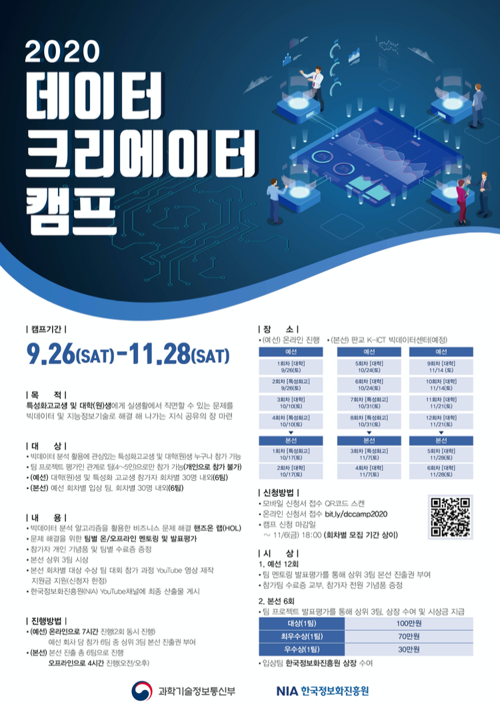

# 2020 데이터 크리에이터 캠프

## 강의 계획서
|강의|이름|코랩|
|--:|:---:|:---|
|1 |전처리|<a target="_blank" href="https://drive.google.com/file/d/1hj2UxQ4DPWBDYL1IyhQQoszZoDp4cx4v/view?usp=sharing">구글 코랩 바로가기</a>|
|2 |회귀| <a target="_blank" href="https://drive.google.com/file/d/1jqtfiYlZ6TC9DBGmwWtYfr-3P8p78lHt/view?usp=sharing">구글 코랩 바로가기</a> |
|3 |분류| <a target="_blank" href="https://drive.google.com/file/d/1G_1BS84KuqqDjCBxAZv5VK0ZjWjp5Cz3/view?usp=sharing">구글 코랩 바로가기</a>|
|4 |군집화 | <a target="_blank" href="https://drive.google.com/file/d/114WTgfoDRNBn3Q6bhRL_qrjn0p_2WucK/view?usp=sharing">구글 코랩 바로가기</a>|

## Contact
류회성: hoesungryu@korea.ac.kr

## Lisence
Copyright 2020 (C) Hoe Sung Ryu all rights reserved. 
